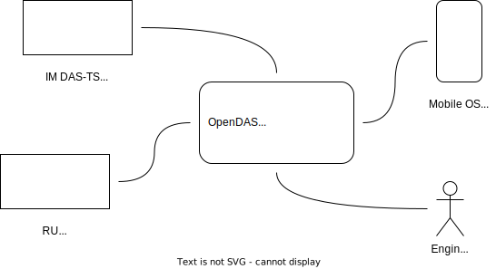

# Driver Advisory System

## Introduction

Driver Advisory System is an innovative tool designed to assist train drivers in the delivery of
efficient and punctual train services. By integrating a wide range of data sources, including live
positioning, infrastructure characteristics, and real-time transport plans, the system calculates
and presents the ideal driving profile for each journey.

This repository is dedicated to the railway undertaking (RU) component of the DAS, encompassing all
aspects necessary for RU implementation and integration.

## Structure

This repository is structured into several key modules, each dedicated to a specific aspect of the
system

### Mobile App

DAS-OB

- [das_client](das_client/README.md)
    - [Dart](https://dart.dev/)
    - [Flutter](https://flutter.dev/)

### Backend

RU DAS-TS

- [das_backend](das_backend/README.md)
    - [Java](https://www.java.com/de/), [openJDK](https://openjdk.org/)
    - [Spring Framework](https://spring.io/projects/spring-framework)
      with [Spring Boot](https://spring.io/projects/spring-boot)

### Tools

#### SFERA Mock

Mock IM DAS-TS

- [sfera_mock](sfera_mock/README.md)
    - [Java](https://www.java.com/)
    - [Spring Framework](https://spring.io/projects/spring-framework)
      with [Spring Boot](https://spring.io/projects/spring-boot)

#### Playground

- [das_playground](das_playground/README.md)
    - [TypeScript](https://www.typescriptlang.org/)
    - [Angular](https://angular.io/)

## Getting-Started

Please refer to the README files in the respective modules for detailed instructions.

## License

This project is licensed under [GPL v3.0](LICENSE).

## Contributing

This repository includes a [CONTRIBUTING.md](CONTRIBUTING.md) file that outlines how to contribute
to the project, including how to submit bug reports, feature requests, and pull requests.

## Coding Standards

This repository includes a [CODING_STANDARDS.md](CODING_STANDARDS.md) file that outlines the coding
standards that you should follow when contributing to the project.

## Code of Conduct

To ensure that your project is a welcoming and inclusive environment for all contributors, you
should establish a good [CODE_OF_CONDUCT.md](CODE_OF_CONDUCT.md)
