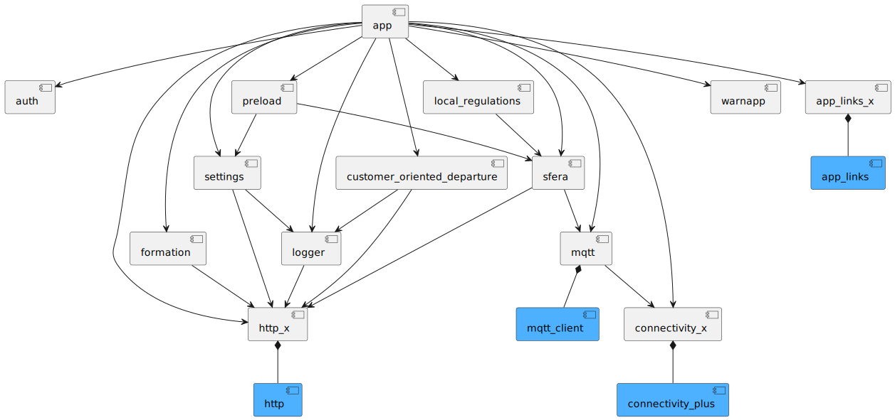

# DAS-Client

DAS (Driver Advisory System) is a mobile application that provides all the required journey data to the train driver.

## Supported platforms

The UI/UX of the DAS-Client is optimized for **tablet** (at least 11") usage only!

<div id="supported_platforms">
  
  
</div>

## Build and run

### Setup

This app uses [FVM](https://fvm.app/) to configure the Flutter SDK version and [Melos](https://melos.invertase.dev/) for
mono-repos support.

* [FVM installation guide](https://fvm.app/documentation/getting-started/installation)
* [Melos installation guide](https://melos.invertase.dev/getting-started)

### Generate code

Hint:

* [Android Studio](https://developer.android.com/studio) is recommended as an IDE (Flutter Plugin,
  tablet emulator, etc).

Use the following Melos command to generate the necessary code for all the components:

```shell
fvm dart run melos generate
```

### Run Application

DAS Client has 3 distinct flavors: `dev`, `inte` and `prod`. Run them as follows:

```shell
cd app
fvm flutter run --flavor dev -t lib/main_dev.dart
```

```shell
cd app
fvm flutter run --flavor inte -t lib/main_inte.dart
```

```shell
cd app
fvm flutter run --flavor prod -t lib/main_prod.dart
```

## Architecture

In general, we aim to follow the
recommended [Flutter architecture guidelines](https://docs.flutter.dev/app-architecture) as closely as possible.
We deviate purposefully for the following concepts:

* We have decided to adopt the *Packages by Component* approach instead of a *Layered Architecture* using Dart
  workspaces

### Components

The app is separated into the following components:



| Component             | Description                                                                            |
|-----------------------|----------------------------------------------------------------------------------------|
| **app**               | UI implementation with Flutter components                                              |
| **auth**              | User authentication and authentication state management.                               |
| **connectivity_x**    | Provides device connectivity handling                                                  |
| **http_x**            | Extension for http package that supports authorization and log requests and responses. |
| **local_regulations** | Handles generation of HTML for local regulations                                       |
| **logger**            | Handles app logs caching and rollover to remote for monitoring                         |
| **mqtt**              | Handles MQTT client auth and communication                                             |
| **settings**          | Provides settings like enabled RU features                                             |
| **sfera**             | SFERA api integration with local database for caching                                  |
| **warnapp**           | Alogrithm to detect start and stop of train                                            |
| **formation**         | Provides formation including brake-/loadslip information                               |

### Component Naming

Keep the component names as short as possible (e.g. mqtt, auth).
In case of a naming conflict:

* Rename: logging → logger
* Extension: http → http_x

## Testing

### Running unit tests

Use the following Melos command to run all component tests:

```shell
fvm dart run melos test
```

### Running integration tests

Instrumentation tests do not use user authentication. Therefore, the credentials must be provided as
environment
variables.
Run the following command in the `app` directory.

```shell
fvm flutter test --flavor dev --dart-define=MQTT_USERNAME=${MQTT_USERNAME} --dart-define=MQTT_PASSWORD=${MQTT_PASSWORD} integration_test/app_test.dart
```

#### Integration tests on Android emulator

The Android emulator has trouble handling a lot of integration tests. Try the following to increase stability:

* Start the emulator with a cold boot before each run
* Use hardware acceleration and enough RAM (4GB recommended)
* Check if emulator time matches the host time

Try running the tests in multiple batches if none of the above work.

### Test resources

In general, the same test resources are used both for unit testing and integration testing in order to avoid confusion
and unwanted differences.

Fictive train numbers with the prefix `T` are used for test scenarios. It is desired to create new train journeys for
different features.

The test resources are located within the `sfera_mock` project in the DAS monorepo. They are linked
by [symbolic links](https://en.wikipedia.org/wiki/Symbolic_link) into the
`das_client` [test_resources](sfera/test_resources) directory to avoid any differences between them. If needed, these
unit test resources are extended in the `das_client` directory. To create symbolic links, run the following command on a
UNIX system:

```shell
ln -s PATH_TO_SRC_FILE PATH_TO_DEST_DIR
```

e.g. to create the `SFERA_JP_T1.xml` symlink, run:

```shell
cd sfera/test_resources/T1_track_equipment
ln -s ../../../../sfera_mock/src/main/resources/static_sfera_resources/T1_track_equipment/SFERA_JP_T1.xml .
```

The resulting file structure for a test scenario looks as follows:

* base directory named `<train number>_<optional description>`
* journey profile named `SFERA_JP_<train number>_<optional postfix>`
* corresponding segment profiles named `SFERA_SP_<train number>_<segment number>`
* corresponding train characteristics named `SFERA_TC_<train number>_<tc number>`  
  An example test scenario for train number T1 could look like this:
* T1_demo_journey/
    * SFERA_JP_T1.xml
    * SFERA_JP_T1_without_stop.xml (additional to resources in `sfera_mock`)
    * SFERA_SP_T1_1.xml
    * SFERA_SP_T1_2.xml
    * SFERA_TC_T1_1.xml

## Custom Icons

To add custom icons, you can upload [font_config.json](app/font_config.json)
to [fluttericon](https://www.fluttericon.com/) and add your icon.
Use [SVG Strokes to Fills Converter](https://iconly.io/tools/svg-convert-stroke-to-fill) if SVG is not compatible with
fonts.

## Localization

The app is available in three languages:

<div id="supported_languages">
  
  
  
</div>

Localization terms/keys conform to the following format:

```
<PREFIX>_<CONTEXT?>_<LABEL>
```

The prefix is mandatory and indicates the scope of the term. Valid prefixes are:

| Prefix | Scope  | Description                                    |
|--------|--------|------------------------------------------------|
| c      | Common | Common terms that can be used in the whole app |
| p      | Page   | Terms that belong to a specific page           |
| w      | Widget | Terms that bleong to a specific widget         |

The context is optional and indicate where a localization is used. When a localization is scoped to a page or widget,
the context MUST be equal to the name of that page or widget.
For example, localizations used on the login page would start with `p_login_`.

The generation of the localization code is included in the `melos generate` command.
