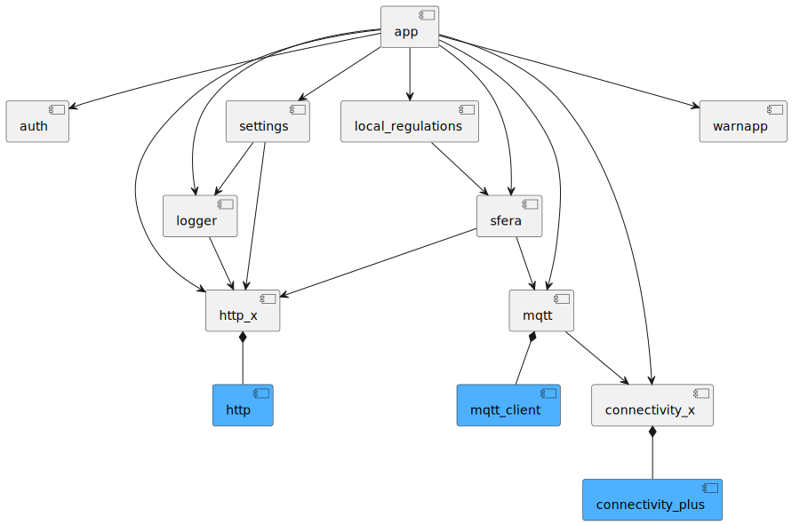

# DAS Client

DAS (Driver Advisory System) is a mobile application that provides all the required journey data to the train driver.

## Supported platforms

<div id="supported_platforms">
  
  
</div>

## Build and run

### Setup

This app uses [FVM](https://fvm.app/) to configure the Flutter SDK version and [Melos](https://melos.invertase.dev/) for mono-repos support.

* [FVM installation guide](https://fvm.app/documentation/getting-started/installation)
* [Melos installation guide](https://melos.invertase.dev/getting-started)

### Generate code

Use the following Melos command to generate the necessary code for all the components:

```shell
fvm dart run melos generate
```

### Run Application

DAS Client has 3 distinct flavors: `dev`, `inte` and `prod`. Run them as follows:

```shell
fvm flutter run --flavor dev -t lib/main_dev.dart
```

```shell
fvm flutter run --flavor inte -t lib/main_inte.dart
```

```shell
fvm flutter run --flavor prod -t lib/main_prod.dart
```

## Architecture

In general, we aim to follow the recommended [Flutter architecture guidelines](https://docs.flutter.dev/app-architecture) as closely as possible.
We deviate purposefully for the following concepts:

* We have decided to adopt the *Packages by Component* approach instead of a *Layered Architecture* using Dart workspaces

### Components

The app is separated into the following components:



| Component      | Description                                                                            |
|----------------|----------------------------------------------------------------------------------------|
| **app**        | UI implementation with Flutter components                                              |
| **auth**       | User authentication and authentication state management.                               |
| **http_x**     | Extension for http package that supports authorization and log requests and responses. |
| **mqtt**       | Handles MQTT client auth and communication                                             |
| **sfera**      | SFERA api integration with local database for caching                                  |
| **logger**     | Handles app logs caching and rollover to remote for monitoring                         |

### Component Naming

Keep the component names as short as possible (e.g. mqtt, auth).
In case of a naming conflict:
* Rename: logging → logger
* Extension: http → http_x

## Testing

Use the following Melos command to run all component tests:

```shell
fvm dart run melos test
```

### Running Integration Tests

Instrumentation tests do not use user authentication. Therefore the credentials must be provided as environment variables.

```shell
fvm flutter test --flavor dev --dart-define=MQTT_USERNAME=${MQTT_USERNAME} --dart-define=MQTT_PASSWORD=${MQTT_PASSWORD} integration_test/app_test.dart
```

### Test file structure

To prevent confusion, fictive train numbers with the prefix `T` are used for the test scenarios. It is desired to create new train journeys for different features.  
The file structure in [test_resources](sfera/test_resources) for a test scenario looks as follows:

* base directory named `<train number>_<optional description>`
* journey profile named `SFERA_JP_<train number>_<optional postfix>`
* corresponding segment profiles named `SFERA_SP_<train number>_<segment number>`
* corresponding train characteristics named `SFERA_TC_<train number>_<tc number>`  
  An example test scenario for train number T1 could look like this:
* T1_demo_journey/
  * SFERA_JP_T1
  * SFERA_JP_T1_without_stop
  * SFERA_SP_T1_1
  * SFERA_SP_T1_2
  * SFERA_TC_T1_1
    <a name="localization"></a>

## Custom Icons

To add custom icons, you can upload [font_config.json](app/font_config.json) to [fluttericon](https://www.fluttericon.com/) and add your icon. 
Use [SVG Strokes to Fills Converter](https://iconly.io/tools/svg-convert-stroke-to-fill) if SVG is not compatible with fonts.

## Localization

The app is available in three languages:

<div id="supported_languages">
  
  
  
</div>

Localization terms/keys conform to the following format:

```
<PREFIX>_<CONTEXT?>_<LABEL>
```

The prefix is mandatory and indicates the scope of the term. Valid prefixes are:

| Prefix | Scope  | Description                                    |
|--------|--------|------------------------------------------------|
| c      | Common | Common terms that can be used in the whole app |
| p      | Page   | Terms that belong to a specific page           |
| w      | Widget | Terms that bleong to a specific widget         |

The context is optional and indicate where a localization is used. When a localization is scoped to a page or widget, the context MUST be equal to the name of that page or widget.
For example, localizations used on the login page would start with `p_login_`.

The generation of the localization code is included in the `melos generate` command.

## Code style

This application uses the code style defined in the [Flutter Wiki](https://github.com/flutter/flutter/blob/master/docs/contributing/Style-guide-for-Flutter-repo.md). 
The recommendations are mandatory and should always be followed unless there is a good reason not to do so. However, this must be approved by all developers.

Notable difference: Line length is set to 120 characters. Please adapt your IDE configuration accordingly.

For formatting XML test files, contact a developer for custom Android Studio XML formatting setup.