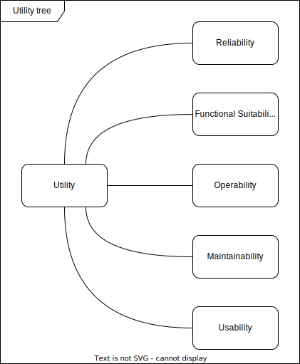

The [Quality Requirements in section 10](../../10_quality_requirements/) detail the following **key quality objectives** of DAS and serve to evaluate their achievement.

| Quality Goal                                                            | Motivation/description                                                                                                                      |
|:------------------------------------------------------------------------|:--------------------------------------------------------------------------------------------------------------------------------------------|
| Railway operations depend on it (Reliability)                           | S. [Reliablilty](../10_quality_requirements/01_quality_tree.md)                                                                             |
| Provided information is correct (Functional Suitability)                | S. [Functional Suitability](../10_quality_requirements/01_quality_tree.md)                                                                  |
| Reliable and efficient operation (Operability)                          | S. [Reliablilty](../10_quality_requirements/01_quality_tree.md) and [Interaction Capability](../10_quality_requirements/01_quality_tree.md) |
| Changes need to be implemented efficiently and safely (Maintainability) | S. [Maintainability](../10_quality_requirements/01_quality_tree.md)                                                                         |
| Support, not distract the engine driver (Usability)                     | S. [Interaction Capability](../10_quality_requirements/01_quality_tree.md)                                                                  |
| Provide safe public & cargo transport (Safety)                          | S. [Safety](../10_quality_requirements/01_quality_tree.md)                                                                                  |

