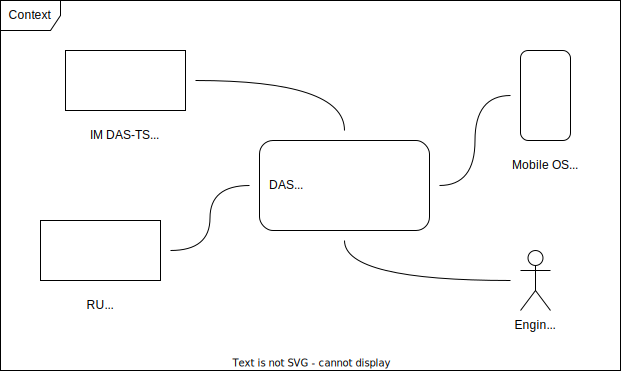

DRAFT

### IM-DAS TS (external system)
Generates and provides all the necessary information as driving advice for each train.

### RU (external system)
Provides additional, RU-specific information via API to support the work of the engine driver.

### Mobile OS (external system)
Represents the runtime environment for the On-Board component (client). 

### Engine Driver (user)
Uses the DAS On-Board to get information relevant for operating the train.