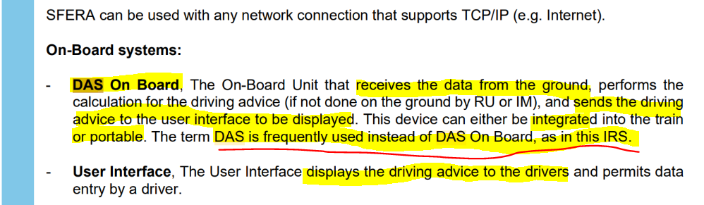
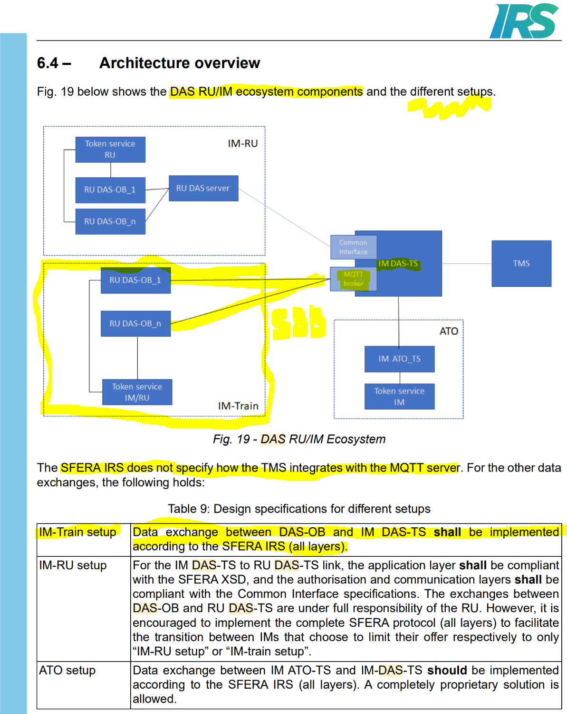

## Blueprint by UIC "IRS-90940:2022 Ed.2" Specification

Some abbreviations from the Specification:
* DAS-OB: DAS OnBoard
* DAS-TS: DAS Trackside
* G2B: Ground to Board
* B2G: Board to Ground
* IM: Infrastructure Manager
* RU: Railway Undertaking

**This project is all about the `DAS On-Board` component** implemented by SBB:

At SBB the **IM-Train setup** respectively `IM DAS-TS` to many `RU DAS-OB[n]` instances by `MQTT` variant is chosen by design-decision:

## SBB Component Architecture
The architecture of the SBB implementation of `DAS-Client` and `SFERA protocol` keeps exactly to the blueprint variant **IM-Train setup** by IRS-90940 above, where the following naming is used:  
| IRS Component | SBB Component |  
| ------------- | ------------- |  
| IM DAS-TS     | TMS::VAD      |  
| RU DAS-OB     | DAS-Client    |  

Other blue components represent a best known goal in the near future and may be concretised over time.

