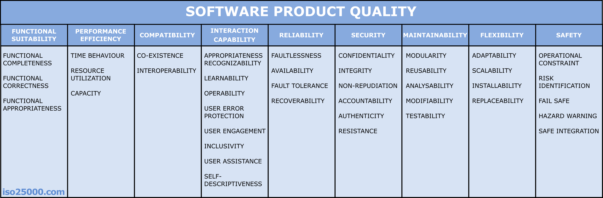

[Software Product Quality ISO 25010](https://www.iso25000.com/index.php/en/iso-25000-standards/iso-25010)

(see [most important subset](02_major_non_functional_requirements.md))

Functional Suitability
: DAS only displays and never modifies data. A data source can rely on DAS to present the provided
data as is and with the intentioned meaning. Requirements go through a verficiation and validation process where cooperation partners are involved too.

Performance Efficiency
: DAS-Client provides a sufficient response time for users (drivers).

Compatibility
: DAS-Client commits to SFERA standard. Scoped reusable for Swiss RUs. Cross availability for iOS and Android devices.

Interaction Capability
: DAS-Client will be used by train drivers on-board. A driver should not be distracted unnecessarily by the system,
therefore providing a simple and concise user interface for engine drivers to support operations and avoid
distractions is paramount (UX and test-involvement of relevant users is key).
The system is efficient to operate and oversee.
Problems can be identified and mitigated in a timely manner ([Logging](../09_design_decisions/mobile_logging_adr.md), Monitoring/Tracing (Instana), Crash-Recorder (Crashlytics), Dashboards).

Reliability
: DAS is available during all railway operations by a driver. Failures of an external system shall not prevent DAS
from providing all available information. Offline features may compensate lost network connections. Resilient decoupling.

Security
: DAS is usable by authenticated users/tenants using MS Entra ID (user flow) and API-Management. Machine-to-machine relies on OAuth2 tokens.
[Swiss government recomendations for Cyber-Security](https://www.ncsc.admin.ch/ncsc/de/home/infos-fuer/infos-it-spezialisten/themen/ikt-minimalstandards.html) are considered.

Maintainability
: New functionality can be implemented in a predictive manner while guaranteeing to not break
existing functionality. Additional railway undertakings can be easily integrated. CENELEC drives the change
process for safety relevant telematic applications.
SBB Governance/Standards are covered.
Open source documentation.
Automated dependency checker and Arch Unit (DDD) keeps the system architecture clean.

Flexibility
: DAS-Client installation by App stores. Backends are cloud based and therefore easy scalable.

Safety
: SBB Safety Management System (SMS) K 250 Risk Analysis, CENELEC Norms SN EN 50126 & SN EN 50716 (Testability and Traceability), ISO 9001 Quality System.
Cabine-Simulator. The circumstances of the use of the system are always respected. No unnecessary functionality or distracting features will be implemented.
Supervised and audited by Swiss Government ([BAV](https://www.bav.admin.ch/bav/de/home.html))