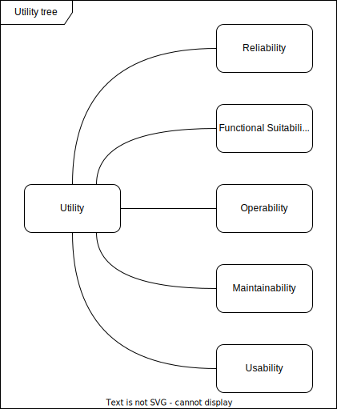

The priority quality objectives of DAS in order of importance.

Reliability - Railway operations depend on it.
: Details see [Reliablilty](01_quality_tree.md)

-> Entkopplung; Azure down: keine Chance (spielt keine Rolle, wenn drin, bis Refresh
failed); Daten vorladen; was passiert, wenn keine Netzwerkverbindung (Login offline möglich, Caching
der Anmeldeinformationen); möglichst wenige Umsysteme / Abhängigkeiten
Authentifizierung (MS Entra ID) / Token-Gültigkeit MQTT, TMS Konfiguration

Functional Suitability - Provided information is correct.
: Details see [Functional Suitability](01_quality_tree.md)

-> Ausführliche Tests (end-to-end); Zwischensysteme vermeiden; View-Model read-only (final); Mapper;
Testsuite; UI-Tests, v.a. für SFERA

Operability - Reliable and efficient operation.
: Details see [Reliablilty](01_quality_tree.md) and [Interaction Capability](01_quality_tree.md)

Maintainability - Changes need to be implemented efficiently and safely.
: Details see [Maintainability](01_quality_tree.md)

-> keine unnötigen Dependencies (automatised Check); APIM; Modularisierung (auch Projektstruktur); Lint enforced Modularisierung; Arch Unit (DDD)

Usability - Support, not distract the engine driver
: Details see [Interaction Capability](01_quality_tree.md)

-> Research; Einfluss/Zusammenarbeit im Entwicklungsprozess mit Kooperationspartnern

### Further objectives which are relevant for DAS in the context of Functional Suitability:

Safety - No influence on safety of operations
: Details see [Safety](01_quality_tree.md)

Auditability - Like an open book
: It is easy to check and understand the functionality, data flows and logic.

-> Logging; Open Source; comprehensive documentation
